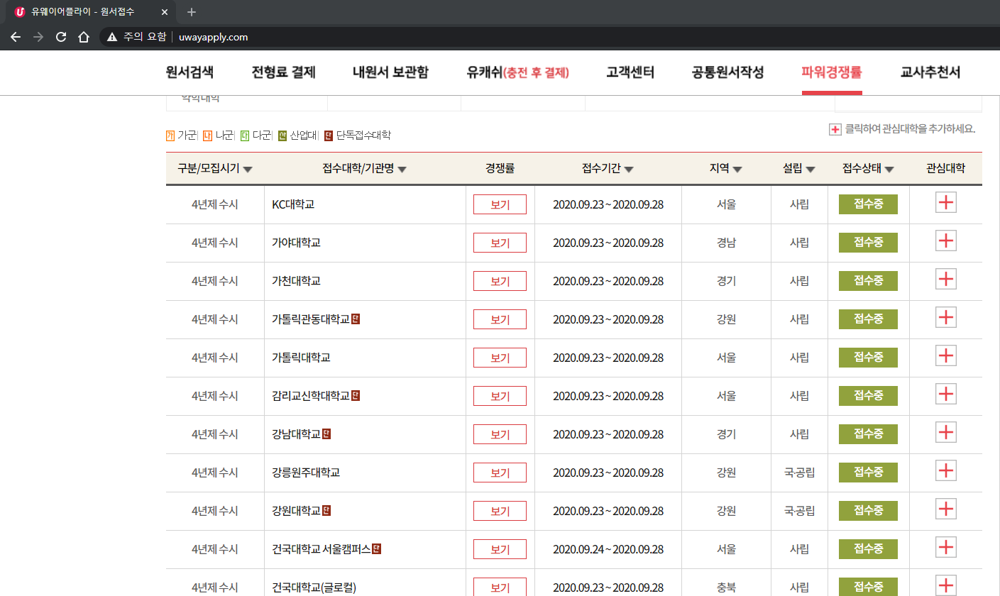
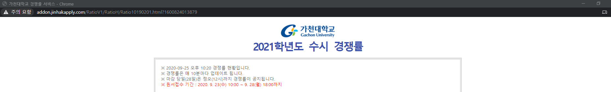
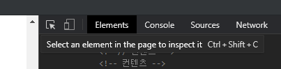
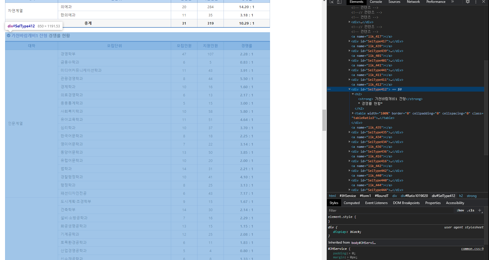
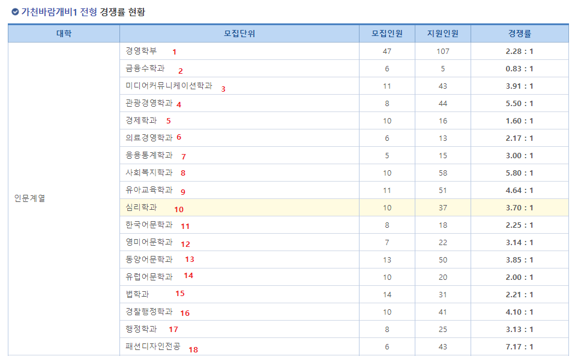

# 귀찮은 대학 경쟁률 파서 사용법

## 개발환경 셋팅
1. 파이썬3 깔아주세요
2. `requests`랑 `BeautifulSoup4` 깔아주세요

## 정보 수집
1. [http://www.uwayapply.com/](http://www.uwayapply.com/)에 들어가서 `파워 경쟁률` 탭에 들어가세요


2. 경쟁률 보기 누르면 팝업이 뜹니다.  

팝업창의 url을 기억해두세요.

3. 그 다음 개발자 도구 (크롬 기준 f12) 키고 `Select an element in page to inspect it(크롬 단축키 ctrl + shift + c)`를 눌러서 해당 전형의 `div` 뒤의 아이디 값을 봐주세요.


uway는 아이디가 `Div`어쩌고 진학은 `SelType`어쩌고 입니다.


4. 마지막으로 지원하신과가 해당 전형에서 몇번째인지 세어주세요.
세는거 귀찮으면 코드에서 for 돌려보세요.


## 함수에 넣으세요
라이브러리까지 갈 스케일도 아니라서 그냥 함수 하나로 박았어요.
apply함수입니다

매개변수는
> (필수)url: 경쟁률 링크(str), 기본값 없음
> 
> (필수)selector: 전형 div의 id(str), 기본값 없음
> 
> name: 학교명(str), 기본값 '대'
> 
> encode: 인코딩(str), 기본값 'utf-8' 인데 그냥 안넣으시면 알잘딱깔센으로 유웨이랑 진학꺼 구분해서 넣습니다.
> 
> (필수)n: 몇번째인지(int), 기본값 1
> 
> shift: 몇개 밀껀지(int), 기본값 0 이거는 한양대 에리카가 이상하게 파싱해오면 전부 인덱스가 하나씩 밀리길래 넣었고요  
> 밑의의 예시처럼 안나올경우에만 1부터 넣어보시면 될듯합니다

## 예시
```python
apply('http://addon.jinhakapply.com/RatioV1/RatioH/Ratio10190201.html?1600824013879', 'SelType436', name='가천대', n=2)
apply('http://ratio.uwayapply.com/2021/susi2/kyonggi/1/', selector='Div_0076', name='경기대', n=15)
apply('http://addon.jinhakapply.com/RatioV1/RatioH/Ratio11650301.html?1600905697121', selector='SelType4S', name='한양대에리카', n=1, shift=1)
```

대학 잘 붙으세요~
